# SHARC Practical Guide

The SHARC universal IoT sensor adapter is the quickest method of capturing industrial sensor observations.  With native JSON and MQTT output, the SHARC is ready to transmit data to any networked application within minutes.

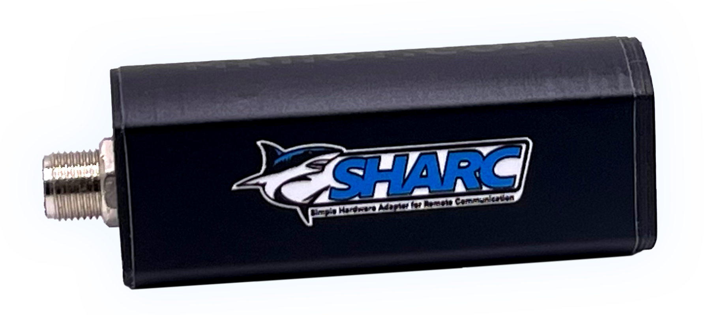

This manual will teach you how to:
* select an industrial sensor
* configure your SHARC
* install sensor and capture data
* transmit sensor data to a MQTT server
* interact with the SHARC over MQTT

## Get Familiar with the SHARC

Become familiar with your SHARC by reading the data sheet and setup instructions.

1. [Data Sheet](https://www.mriiot.com/s/SHARC-Data-Sheet-Latest.pdf)  (https://www.mriiot.com/s/SHARC-Data-Sheet-Latest.pdf)
2. [Setup Instructions](https://www.mriiot.com/s/SHARC-Setup-Instructions.pdf)  (https://www.mriiot.com/s/SHARC-Setup-Instructions.pdf)

## Sensor Selection

Industrial sensors can be divided into two types, discrete and analog. A discrete sensor can have two states, on or off.  An analog sensor value is represented across a range of values, such as one volt, one and a half volts, two volts, and so on.  Industrial sensors are powered with 24 volts DC.  They typically have a M12 barrel connector where pin 1 is positive, pin 3 is negative or ground, and pin 4 is the signal.  In a case where a sensor supports multiple types of outputs, pin 2 is used for the secondary signal.  An example of this is a discrete sensor that can be configured as a PNP or NPN circuit.  Another example is an analog sensor where the secondary signal is an alarm when some measurement threshold is crossed.

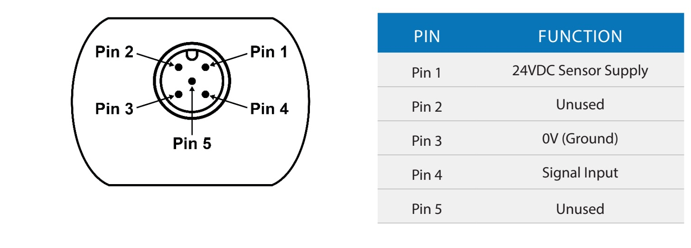

The SHARC supports four different sensor types:
* discrete PNP
* discrete NPN
* analog 0-10V
* analog 4-20mA

Lets review the utility and purpose of several different sensors.

### Part Presence and Detection

The Banner Engineering QX4 laser sensor is a highly configurable  discrete sensor with both PNP and NPN circuits.  It is ideal for counting material moving through a process to determine part counts, throughput, and utilization.  Other sensors, such as proximity sensor or inductive ring sensor can be used where practical. 

TODO: image

### Rotational Speed of a Machine Component

An encoder can be placed on the end of a shaft or attached to a wheel to measure the rotational speed of a machine component or the speed at which material is moving through a process.  An encoder resolution determines how many ‘ticks’ there are in a single rotation.  Each discrete ‘tick’ is a signal detected by the SHARC, which can detect signals up to 9kHz or 9000 per second.

TODO: image

### Operating State of a Machine Component

Many machine components operate on AC power.  Using an analog current transformer (CT) sensor we can measure the amperage flowing through a power circuit.  As an example, we can place a CT sensor on laser power source to determine the on time of a laser cutter.  When the laser cutter is running it will draw some current.  By setting a threshold we can capture the times at which the laser starts and stops.

TODO: image

### Direct Observation of Temperature or Pressure

Other important process variables might include temperature or air and hydraulic pressure.  Using the appropriate analog sensor we can directly observe the process variable over time.

TODO: image

## SHARC Configuration

You can think of the SHARC as an adapter, just like the ones you might use at home to convert a USB to an HDMI signal.  The M12 barrel connector of the SHARC accepts an industrial sensor.  The  RJ45 network connector of the SHARC provides network communications to both configure the device and retrieve sensor  readings.  The four position rotary switch determines which sensor circuit is active.  If you are connecting a PNP sensor, set the rotary switch to position zero.  If you are connecting a 4-20mA sensor, set the rotary switch to position three.

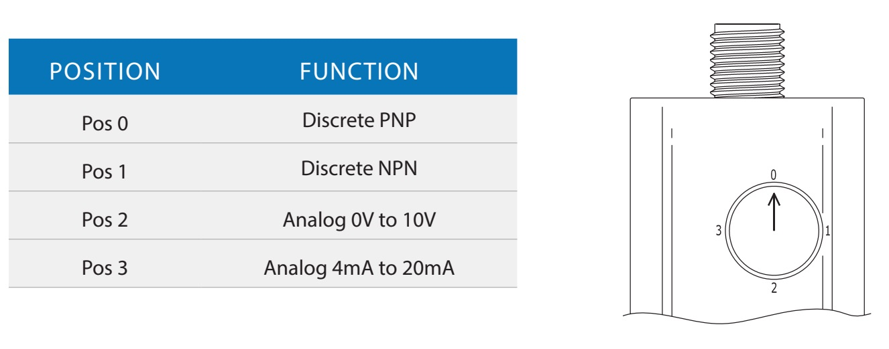

Both the SHARC and sensor require power.  There are two options for power delivery.  The first option is to use Power-over-Ethernet.  

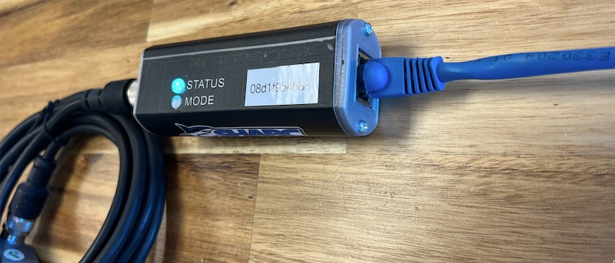

The second option is to use a Y-cable or T-adapter and provide power over the M12 barrel connector.  The second option is practical when WIFI wireless transmission is possible and 24VDC can be diverted from the machine’s power.

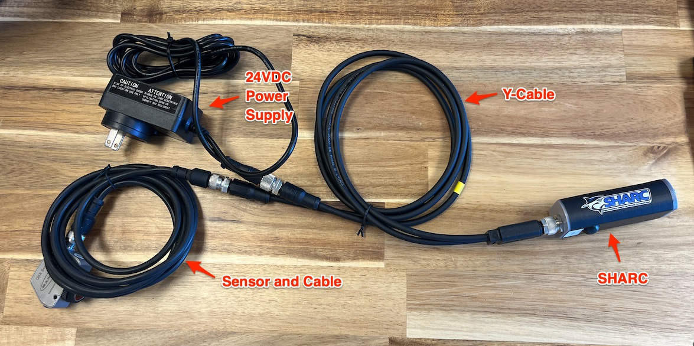

Connect the sensor and SHARC together using the provided five pin M12 cable.  Pin four is always the signal wire.  Pins one and three are the power pins.  

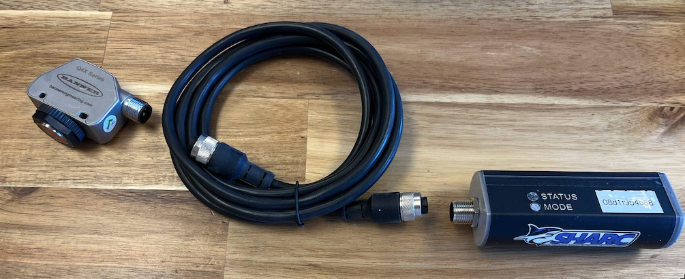

In some cases a field wireable connector must be used to provide the correct pin configuration.

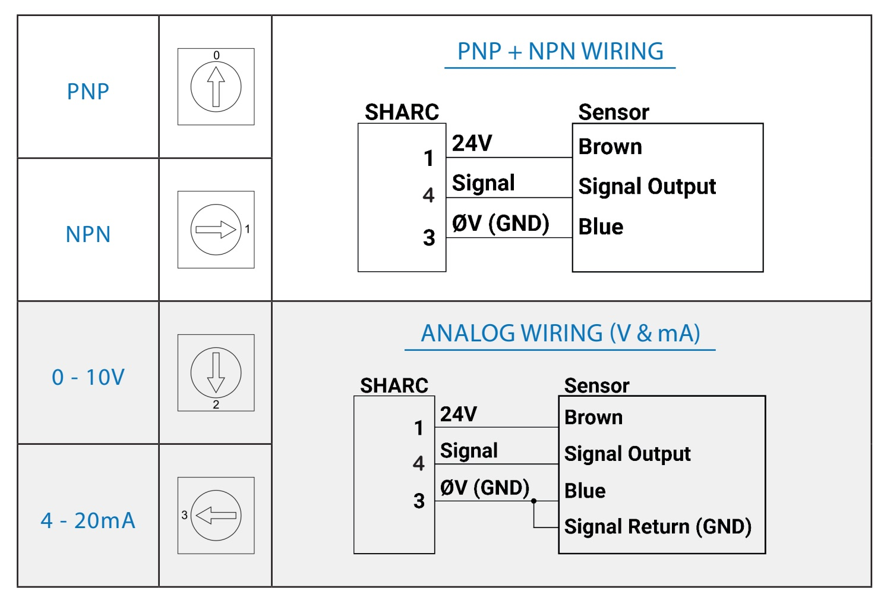

Plug the PoE network cable into the SHARC.  This will power on the SHARC and the sensor.  

While booting, the LED light will remain yellow.  Once booted the light will change to red and green for MQTT network mode or cyan and blue for Bluetooth mode.  Let’s configure the SHARC using Bluetooth.  For this we will either use the SharcStudio iOS app or our Chrome browser on a computer with Bluetooth.  To get the SHARC into Bluetooth mode, hold down the user button until the device reboots, then release the button.  You are in Bluetooth mode when the LED turns cyan color.  You are now ready to establish a connection to the SHARC.

Open your Chrome browser and navigate to https://sharc.tech.  From there select BLE and scan for devices.  Once your device is found, select Pair and wait for the browser to pull the device’s configuration.

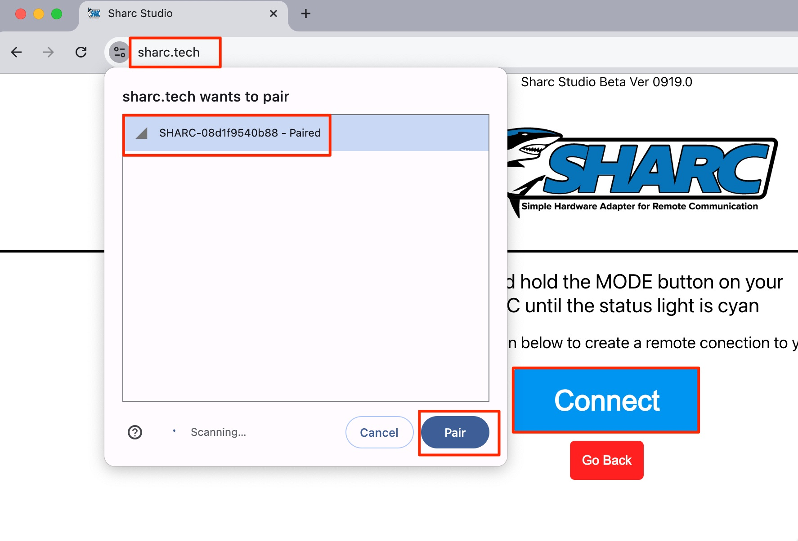

### Device Information

The device information pane displays useful information such as the SHARC unique identifier and firmware version.

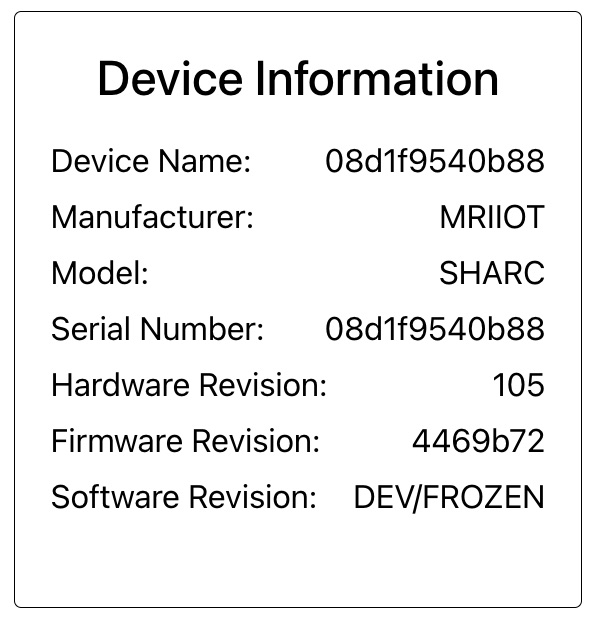

### Network Configuration

The network configuration pane allows you to view the device IP information.  You can also set a static IP configuration or toggle between wired Ethernet and WiFi.

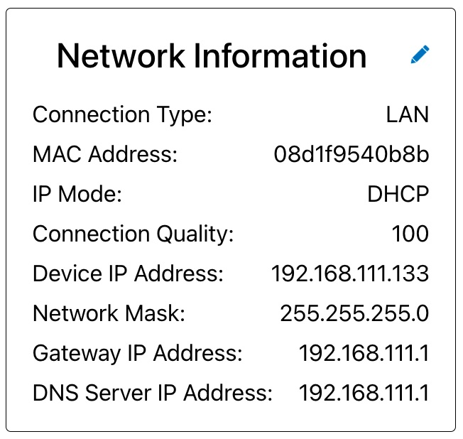

### MQTT Configuration

The MQTT configuration pane allows you to modify which MQTT broker the SHARC will communicate with. User, password, and certificates are all supported.

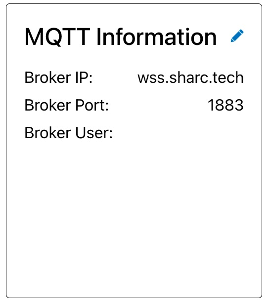

### Sensor Configuration

The sensor configuration pane allows you to configure how each sensor input circuit behaves.  

Discrete sensors can be an on/off boolean value, an incrementing counter, or an accumulator for fast moving signals.  Counter and accumulator can be triggered on the rising edge, falling edge, or both.  Accumulator period is the time interval at which accumulated sensor readings are published to the MQTT broker.

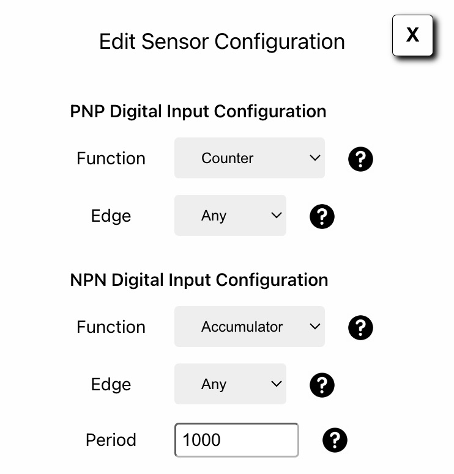

Analog sensors present a linear scaling configuration.  In the below example a reading of 4mA is equivalent to 0psi, where a reading of 20mA is equivalent to 175psi.  This configuration has been set based on the knowledge of the pressure transducer’s rated measurement range of 0 to 175 psi.

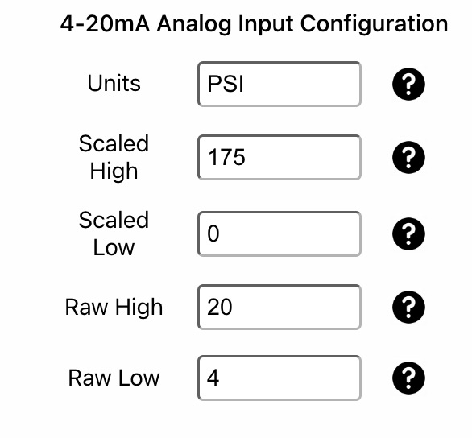

### Live Sensor Data

Below is a view of our PNP discrete sensor readings.  The PNP input has been configured as an incrementing counter.

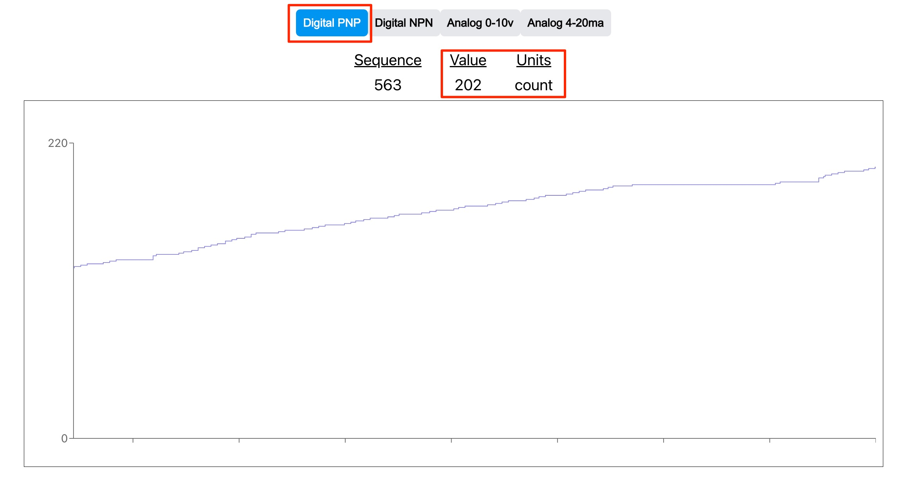

## MQTT Transmission

MQTT is a popular communication protocol across Industry 4.0.  It is light weight and offers a publish and subscribe mechanism well suited for reporting data by exception.  A server or MQTT broker is required as the centerpiece of the deployment.  Each SHARC is an MQTT client to the broker.  The SHARC subscribes to specific topics as channels to configure and interface with the SHARC.  The SHARC also publishes its data to specific topics as channels to get the data out of the device.

### Install an MQTT Broker

We will install the open-source Mosquitto broker on our Windows machine.  Download and install Mosquitto broker from https://mosquitto.org/files/binary/win64/mosquitto-2.0.19-install-windows-x64.exe.  The broker will install itself as a Windows Service.

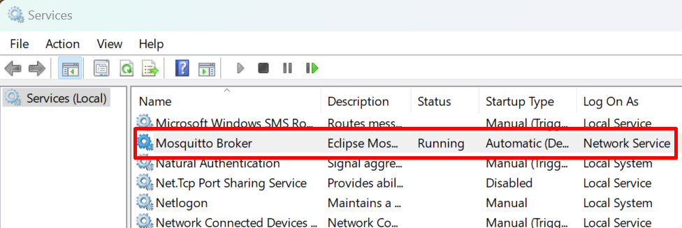

Next, configure the Windows Firewall to allow inbound traffic on TCP port 1883.

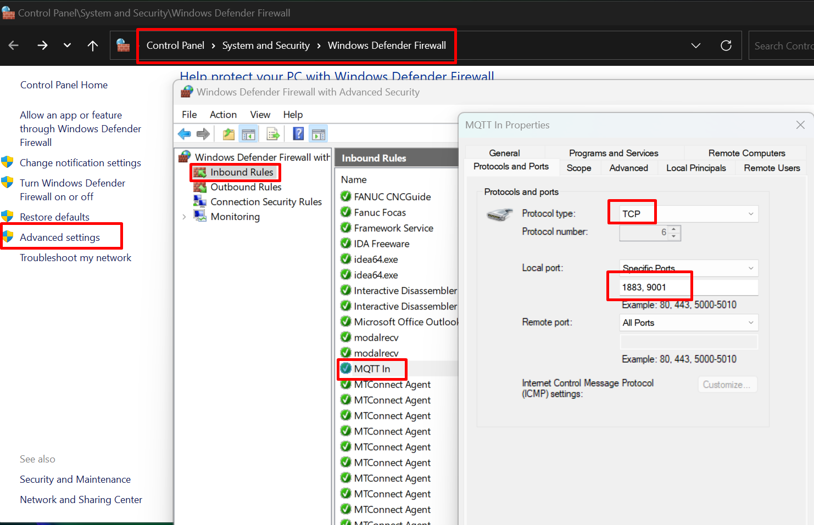

Finally, modify the broker configuration to allow anonymous connections external to your computer.  Then restart the Mosquitto service.

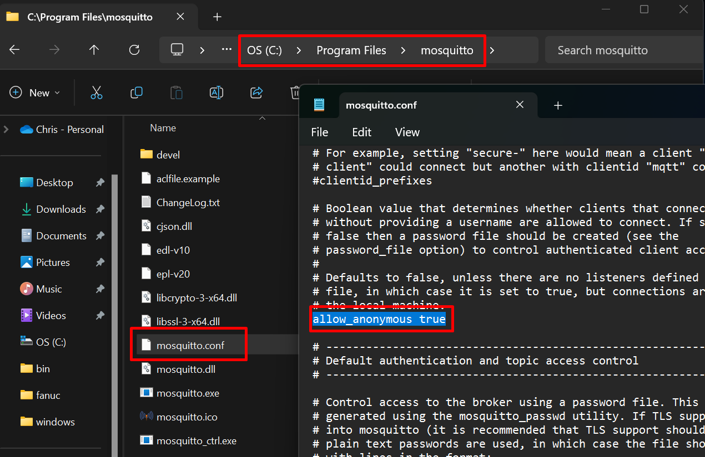

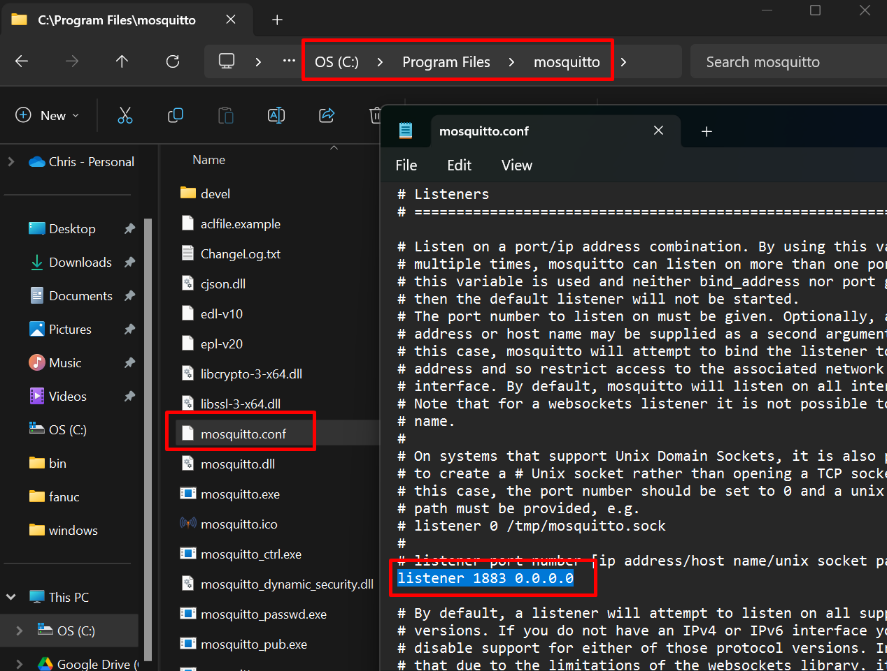

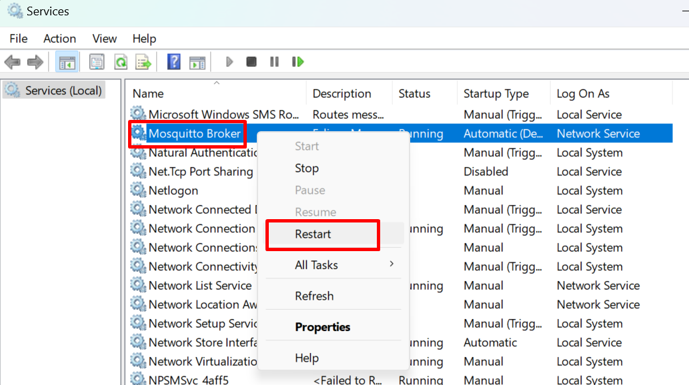

Find your computer’s IP address and test the connection using MQTT Explorer, found here: https://github.com/thomasnordquist/MQTT-Explorer/releases/download/v0.4.0-beta.6/MQTT-Explorer-Setup-0.4.0-beta.6.exe.

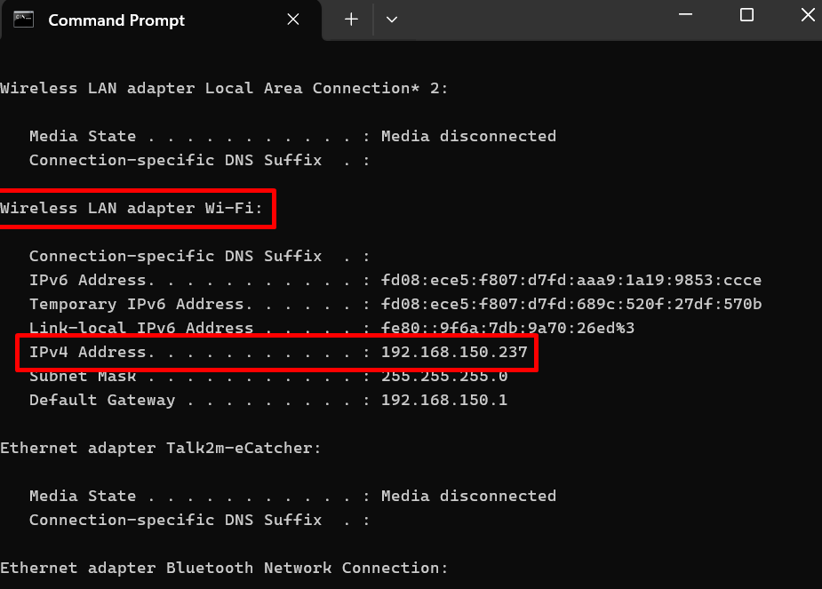

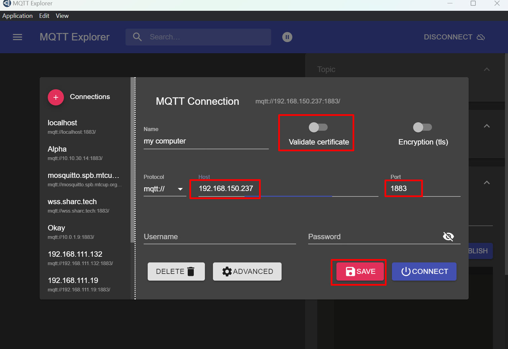

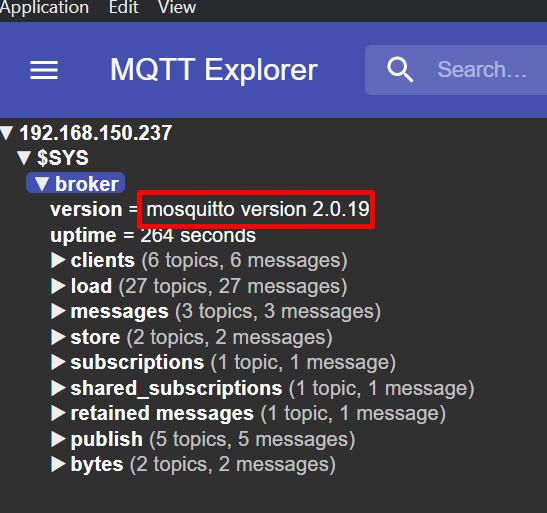

### Point SHARC to Our Broker\

Now that our PC is configured to accept MQTT connections from the outside, let’s connect to our SHARC via Bluetooth and modify the MQTT configuration.  The only setting we need to change is the `Broker IP`.  This will be the IP address of your PC.  In the example above, the IP address is 192.168.150.237.  Your IP address will most likely be different.

Any configuration changes require that the configuration is saved and the SHARC restarted.  You can accomplish this with the power button in the top right.  Save and reboot the SHARC into MQTT mode.

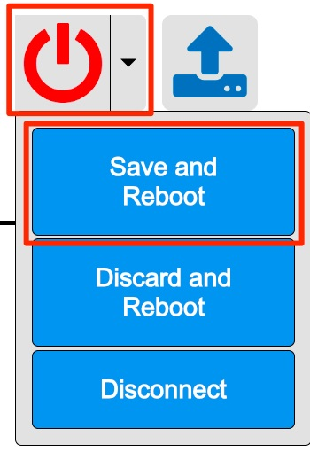

Once the SHARC reboots, the LED should change from red to green.  This means that the SHARC is connected to your PC’s MQTT broker.  If the light remains red, then the SHARC is unable to communicate with the MQTT broker.

### View SHARC Configuration and Sensor Readings

The MQTT topic namespace is broken down into commands and events.  Commands allow the user to interact with the SHARC.  There are two types of commands: actions and configuration.  Actions cause a SHARC behavior, while configuration modifies the SHARC settings.  Events are status messages published by the SHARC.  The topic structures are as follows:

* `sharc/{sharc-id}/cmd/action` - SHARC behavior
* `sharc/{sharc-id}/cmd/cfg` - SHARC configuration changes
* `sharc/{sharc-id}/evt/{event-name}`
    * `avail` - availability and connection status
    * `ver` - version information
    * `rc` - reboot causes and counts
    * `net` - network configuration
    * `mqtt` - MQTT configuration
    * `sensor` - sensor configuration
    * `io` - sensor readings reported by exception

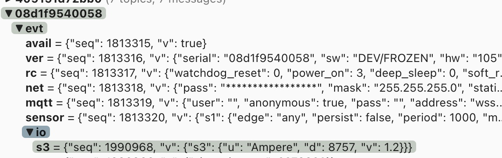

https://sharc.tech has a convenient feature to interact with your SHARC.  The interaction playground can be accessed by clicking the command prompt icon and inputting the password `0000`.

Here you can select and execute various commands.  Full documentation for all commands and events is available on the SHARC Support Github pages, https://github.com/SharcTech/sharc-support?tab=readme-ov-file#mqtt-namespace.

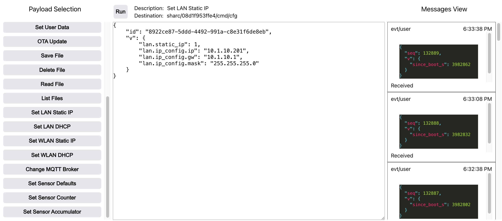

## Next Steps

You have successfully connected and configured your SHARC.  Creating a historical record of sensor readings is the next step toward analyzing process effectiveness and performance.